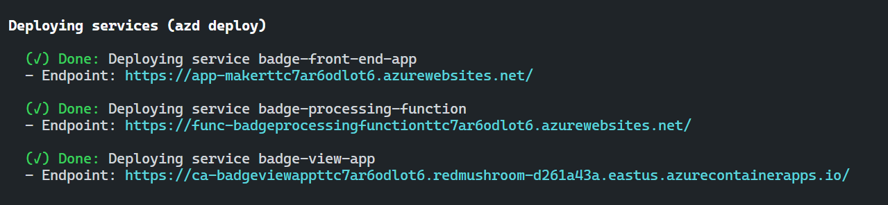
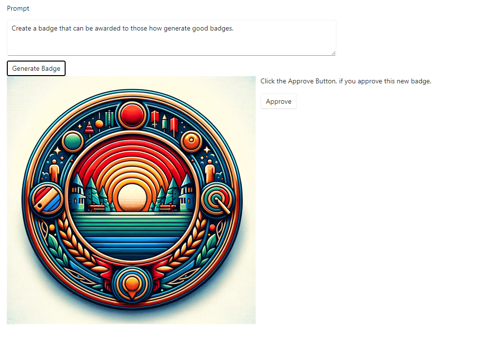
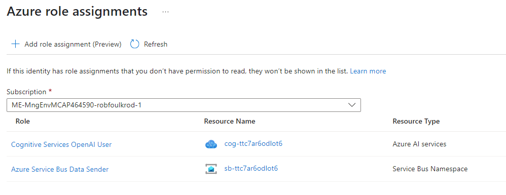

[comment]: <> (please keep all comment items at the top of the markdown file)
[comment]: <> (please do not change the ***, as well as 
 placeholders for Note and Tip layout)
[comment]: <> (please keep the ### 1. and 2. titles as is for consistency across all demoguides)
[comment]: <> (section 1 provides a bullet list of resources + clarifying screenshots of the key resources details)
[comment]: <> (section 2 provides summarized step-by-step instructions on what to demo)

[comment]: <> (this is the section for the Note: item; please do not make any changes here)
***
### Blazor BadgeMaker with Azure AI Services

**Note:** Below demo steps should be used **as a guideline** for doing your own demos. Please consider contributing to add additional demo steps.

[comment]: <> (this is the section for the Tip: item; consider adding a Tip, or remove the section between 
 and 
 if there is no tip)

**Demo scenario story:** 
The BadgeMaker is a Blazor front-end application that provides a user-friendly interface for designing and generating digital badges. It allows users to customize badges with various templates, colors, and text options. Once a badge has been created, it can be "Approved" where it will be sent to an Azure Function for approval. The Azure Function will download the badge from the temporary Dalle storage and drop it permanatly into badge storage. The Approved badges will be available for viewing in the BadgeViewApp. Applicaiton insights can be used to see the end to end process.

***
### 1. What Resources are getting deployed

The demo deploys three appllications and the azure resources to support them.

* Resource group: rg-%env% 
* Log Analytics workspace: log-%random%
* Container Registry: cr%random%
* Application Insights: appi-%random%
* Portal dashboard: dash-%random%
* App Service plan: plan-WebApp%random%
* App Service plan: plan-FunctionPlan%random%
* Storage account: st%random%
* Service Bus Namespace: sb-%random%
* Azure OpenAI: cog-%random%                                                          
* Azure AI Services Model Deployment: cog-%random%
* Container Apps Environment: cae-%random%
* Function App: func-BadgeProcessingFunction%random%
* App Service: app-maker%random%
* Container App: ca-badgeviewapp%random%

### 2. What can I demo from this scenario after deployment

#### Create a Badge

BadgeMaker is a Blazor front-end  that communicated with DALL-E-3 congnitive service. Open the Azure App Service from the deployment. Click the Badge Generator menu item on the left. Enter a description of the badge you want to create and click *Generate Badge*. Click it again to regenerate the image until you get something you like. 

Click the Approve Button and a message will be added to the Service Bus queue sbq-%random%. The message will contain the image URL in Dalle's temporary storage, and the prompt that created the image. The App Service's Managed Identity is used to authenticate to the Message Queue and Cognitive services.

#### Function Approval

 The Azure Function will dequeue the message, and download the image from temporary storage into the storage account st%random% and the *badges* container. Blobs will be have the following metadata set: 
 * approvaltimestamp
 * userprompt

#### View Approved Badges

Open the Container App endpoint to see the Approved badges viewer. Once the function has downloaed them they will be visible in the view. Since the blob names are guids, the will not be in a FIFO order.

#### Application Insights

Applicaiton isnights has been instrumented in all three applications. After a badge has been generated and approved, the end to end process shgould be visible in the Application map. Give time for the consumption SKU function to 'wake up' and process the messages in the queue.

[comment]: <> (this is the closing section of the demo steps. Please do not change anything here to keep the layout consistant with the other demoguides.)
  
***

**Note:** This is the end of the current demo guide instructions.

